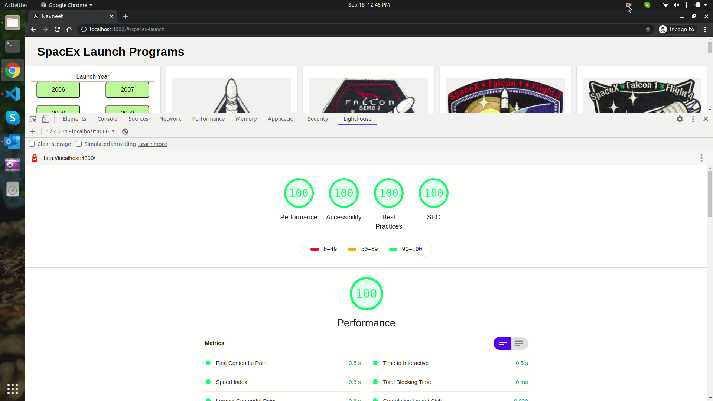
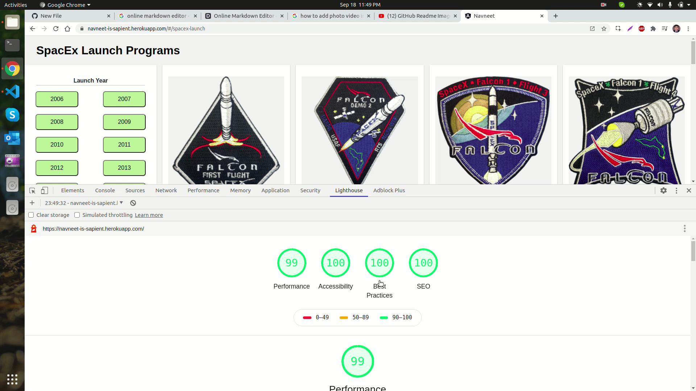

##### Sapient Assignment


# Powered By:
[](https://www.heroku.com/)
#### Tested Environment:
- This app is tested only on Linux Ubuntu 20.04.1 LTS (Focal Fossa).
#### Known Issues:
- Currently server side rendering of this app doesn't work on Windows System.

### Installation
App requires [Node.js](https://nodejs.org/) v12+ to run.
Install the dependencies and devDependencies and follow below steps, to run the app. Visit localhost:4000 or the URL given by cloud serve to see the running app.

```sh
$ git clone https://github.com/techraiders/sapient.git
$ cd sapient
$ npm install
$ npm run build
$ npm start
```

### App has following features:
  - Filters records by launch year, launch success, and land success.
  - Renders the first page on the server using nguniversal.
  - Page is responsive on mobile, tablet, and desktop devices.
  - Installs as PWA in your device, irrespective of operating system.
  - Implementation follows Mobile first design approach.
  - Mobile View: Page has only one Column until 700 px.
  - Tablet View: Page has 2 columns between 700 and 1024 px.
  - Desktop View: Page has 4 columns between 1024 and 1440 px.
  
#### See: [Working Demo](https://navneet-is-sapient.herokuapp.com/#/spacex-launch) 

### Aproach and Stack Details:

App uses a number of open source projects to work properly:

* [Angular](https://angular.io/) - App uses Angular framework for Single Page Web App.
* [Angular Universal](https://www.npmjs.com/package/nguniversal) - Enables Angular app render on the server.
* [Angular Universal Builders](https://www.npmjs.com/package/@nguniversal/builders) - Builds the project to deploy on the production.
* [Angular Express Engine](https://www.npmjs.com/package/@nguniversal/express-engine) - Uses Express Engine to run    Angular Apps on the server for server side rendering.
* [Node.js](https://nodejs.org/) - Runtime Environment that runs the Express Server that serves the requests of the browser.
* [SCSS](https://sass-lang.com/) - Extends the features of CSS, and facilitates Cleaner, Modular Beautiful Styles.
* [Jasmine](https://jasmine.github.io/) - Uses jasmine to unit test feature like component, service etc.
* [Karma](https://karma-runner.github.io/latest/index.html) - Uses Karma to run unit test cases.
* [Bootstrap](https://getbootstrap.com/) - Uses bootstrap-reboot.scss to reset default styles applied by web browser, to avoid cross browser compatibility issues.
* [Compression](https://www.npmjs.com/package/compression) - Uses gzip compression and serves static files from server to browser with Content-Encoding gzip that reduces the requirement of transfer over network and speeeds up initial page load.

### Performance of the app on Local Host:


### Performance of the app on Deployment Server:


